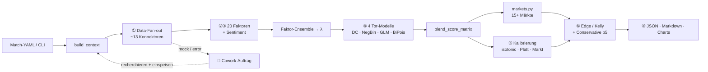
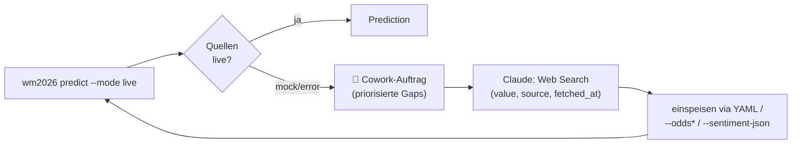

<div align="center">

# 🏆 WM 2026 — Match-Analyse & Prediction Workflow

**Kalibrierter Quant-Workflow für FIFA-WM-2026-Spiele — von Live-Daten zur Value-Wette, reproduzierbar in einem Befehl.**

[](https://github.com/bgjulusgb/football_wm/actions/workflows/ci.yml)


</div>

Modulare Datenschicht → **20-Faktor-Ensemble** → **4-Modell-Tor-Stack** (Dixon-Coles ·
Negative-Binomial · GLM-Poisson · bivariates Poisson) → Prediction mit
Konfidenzintervallen, vollem **Markt-Board** und **Markt-Edge**. **Default = Live-Daten**
aus dem Internet; was die Konnektoren nicht holen, recherchiert **Claude im
Cowork-Auftrag**. `--mode mock` läuft komplett offline (Tests/CI/Reproduzierbarkeit).

## ⚡ Quickstart
```bash
pip install -r requirements.txt
# Live (Default): echte Internet-Daten; Lücken → Cowork-Auftrag für Claude
python -m wm2026.cli predict --home Germany --away Brazil --stage QF \
  --odds "2.40/3.20/2.90" --calibrate market --out reports/
# Komplett offline & reproduzierbar:
python -m wm2026.cli predict --mode mock --match config/matches/group_a/cze_vs_rsa.yaml
python debug.py        # jede Funktion einmal auf Mock-Daten (✅/❌ + Summary)
```

## 🗺️ Architektur (Datenfluss)


| Phase | Inhalt | Code |
|---|---|---|
| ① Data | paralleler Fan-out zu ~13 Konnektoren | `data_sources/orchestrator.py` |
| ②③ Faktoren + Sentiment | 20 Faktoren → `FactorSignal` | `factors/registry.py` |
| ④ Tor-Modelle | Ensemble → λ, 4 Modelle + Bootstrap-CIs | `models_ml/poisson_goals.py` |
| ⑤ Kalibrierung | isotonic + Platt + Markt-Anker (sklearn-frei) | `analysis/calibration.py` |
| ⑥ Markt-Edge | De-Vig, Edge, Kelly + **Conservative p5-Kelly** | `wm2026/edge.py` |
| ⑦ Validierung | Sanity-Checklist + Cowork-Gaps | `wm2026/pipeline.py` |
| ⑧ Output | JSON + Markdown + Charts | `wm2026/report.py` |

## 🎯 Markt-Board
Alle Märkte sind **lineare Funktionale derselben blend-konsistenten Score-Matrix**
(`wm2026/markets.py`) — konsistent mit der Headline-1X2/O-U.

| Markt | Funktion |
|---|---|
| 1X2 · Double Chance · Draw-No-Bet | `one_x_two` · `double_chance` · `draw_no_bet` |
| Over/Under (beliebige + Viertellinien) | `total_over_under` |
| Asian Handicap (inkl. Viertellinien) | `asian_handicap` |
| Team-Totals · Clean Sheet · Win-to-Nil · Odd/Even | `team_total` · `clean_sheet` · `win_to_nil` · `odd_even_goals` |
| **Winning Margin · Multi-Goal-Bands** 🆕 | `winning_margin` · `multi_goal_bands` |
| **Exact-Total-Goals-Verteilung** 🆕 | `exact_total_goals` |
| **First Goal · Halftime/Fulltime** 🆕 | `first_goal` · `ht_ft` |

Die Edge-Tabelle zeigt zusätzlich die konservative `(p5)`-Edge: Value, der die
Bootstrap-Modellunsicherheit überlebt.

## 🤝 Der Cowork-Loop (Claude als Recherche-Instanz)


## 🖥️ CLI
```bash
python -m wm2026.cli predict --match <yaml> [OPTIONS]   # volle Pipeline
python -m wm2026.cli list                               # Match-Configs auflisten
```
`--mode live|mock` (Default **live**) · `--odds "H/D/A"` · `--odds-ou "O/U"` ·
`--odds-btts "Y/N"` · `--odds-dc "1X/12/X2"` · `--odds-ah=-0.5:1.95/1.95` ·
`--calibrate auto|market|none` · `--bootstrap N` · `--out DIR` · `--charts` ·
`--json-only`. Nach `pip install .` auch als `wm2026 …`.

## 📚 Mehr
- **[`prompt.md`](prompt.md)** — Ein-Prompt-Einstieg für Claude Cowork.
- **[`prompts/WM2026_MASTER_PROMPT.md`](prompts/WM2026_MASTER_PROMPT.md)** — volle Methodik.
- **[`verbesserungsplan.md`](verbesserungsplan.md)** — Mathematik-Roadmap.
- **[`CLAUDE.md`](CLAUDE.md)** — Entwickler-/Agenten-Guide (Architektur, Konventionen).
- Optionale Features: `pip install ".[viz]" ".[stats]" ".[sentiment]" ".[full]"` —
  fehlt eins, degradiert der Workflow sauber.

## ✅ Tests & Debug
```bash
pip install pytest
pytest tests/test_wm2026_pipeline.py tests/test_markets.py tests/test_markets_extended.py \
       tests/test_edge_conservative.py tests/test_backtesting_rps.py \
       tests/test_bivariate_poisson.py tests/test_calibration_offline.py -q
python debug.py
```
CI baut auf Python 3.11/3.12 nur den Core, fährt diese Suites + `debug.py` und
erzeugt eine Mock-Prediction als Artefakt.

## 🔒 Sicherheit & Disclaimer
Nie eine echte `.env` committen (Template: `.env.example`); geleakte Keys sofort
rotieren. Forschungs-/Bildungsprojekt — **keine** Wett-Empfehlung, Mock-Vorhersagen
sind illustrativ. Lizenz: [MIT](LICENSE).
