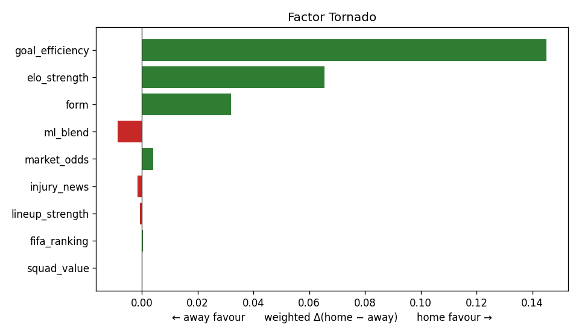
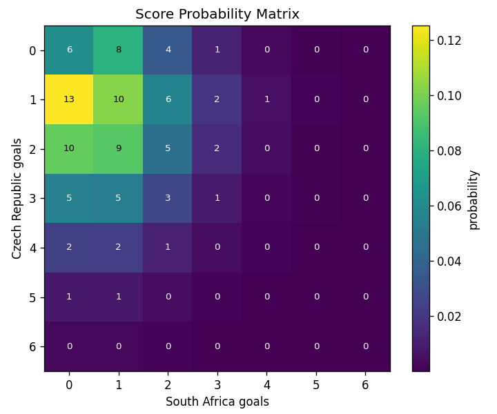
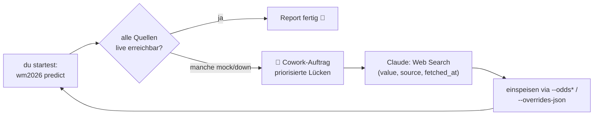
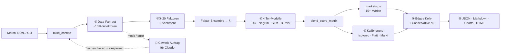

<div align="center">

# 🏆 WM 2026 — Match-Analyse & Prediction Workflow

**Sag Claude welches Spiel — kriegst du eine kalibrierte Prognose mit Quoten-Edge und Markt-Board zurück.**

[](https://github.com/bgjulusgb/football_wm/actions/workflows/ci.yml)


</div>

## ❓ Was ist das?

Du gibst zwei Mannschaften vor, das Programm rechnet daraus eine **Vorhersage** —
Wer gewinnt? Wie viele Tore? Wo lohnt sich eine Wette gegen den Buchmacher? — und
zeigt das Ergebnis als hübschen Report (Markdown · HTML · JSON, optional mit
Charts). **Claude (KI)** ist Teil des Workflows: er recherchiert die Live-Daten
(Quoten, Aufstellungen, Wetter), die das Programm nicht selbst holen kann, und
schickt sie dir verarbeitet zurück. **Forschung/Bildung — keine Wett-Empfehlung.**

---

## 🛠️ Setup

> **TL;DR:** Du brauchst Python 3.11+, einmal `pip install -r requirements.txt`,
> **fertig**. Alles andere ist optional — der Workflow degradiert sauber.
> **In Claude Code on the Web läuft der `.claude/hooks/session-start.sh`-Hook
> automatisch und installiert dir Core + Charts + Sentiment + Stats** —
> kein manuelles `pip install` nötig. Siehe [`SETUP_COWORK.md`](SETUP_COWORK.md).

### 1 · Pflicht (= das musst du wirklich)

```bash
git clone https://github.com/bgjulusgb/football_wm.git
cd football_wm
pip install -r requirements.txt
python debug.py          # Verify: ✅ jede Funktion auf Mock-Daten getestet
```

> **Claude Code on the Web Bonus:** Wenn du in einer Web-Session arbeitest,
> macht der **SessionStart-Hook** das automatisch — du musst nur das Repo
> öffnen und kannst direkt mit "Predict Match X" loslegen. 11 Skills sind
> vorinstalliert (siehe `.claude/skills/`).

Das sind die **Core-Deps** (`numpy`, `scipy`, `httpx`, `PyYAML`, `pydantic`,
`structlog`). Damit läuft die **komplette Pipeline**: alle 15+ Märkte, Edge-/
Kelly-Berechnung, sklearn-freie Kalibrierung, Turnier-Monte-Carlo, HTML-Report.

### 2 · Optionale Python-Extras (nur wenn du das Feature willst)

```bash
pip install ".[viz]"        # PNG-Charts (Tornado + Heatmap) → empfohlen
pip install ".[tui]"        # bunte Terminal-Tabellen (rich) → reine Kosmetik
pip install ".[tune]"       # Offline-RPS-Tuning (Optuna)
pip install ".[stats]"      # exaktes GLM-Poisson + sklearn-Kalibrierung
pip install ".[sentiment]"  # Reddit-Stimmung scoren (VADER + TextBlob)
pip install ".[full]"       # alles auf einmal
```

| Extra | wofür | brauchst du's? |
|---|---|---|
| `[viz]` | matplotlib → PNG-Charts + in HTML eingebettet | ⭐ empfohlen für anschauliche Reports |
| `[tui]` | rich → bunte CLI-Tabellen | nice-to-have |
| `[tune]` | Optuna → `scripts/tune_models_offline.py` | nur wenn du Modell-Params optimierst |
| `[stats]` | statsmodels + sklearn → exakter GLM-Fit | optional — pure-Python-Fallback aktiv |
| `[sentiment]` | VADER + TextBlob → Reddit-Sentiment | optional — Sentiment-Faktor neutralisiert sonst |
| `[cache]` | SQLAlchemy + aiosqlite → Cross-Run-Cache | nur Power-User |
| `[full]` | alles obige | wenn dir Platz egal ist |

Fehlt ein Extra, **fällt der Workflow sauber zurück** (sklearn-fehlt → pure-Python-Isotonic, matplotlib-fehlt → ASCII-Heatmap im Markdown, Optuna-fehlt → klare Fehlermeldung statt Crash).

### 3 · Live-Modus mit echten API-Daten (optional)

Für `--mode live` mit eigenen Buchmacher-Quoten / Reddit / NVIDIA-LLM:

```bash
cp .env.example .env
# .env aufmachen, USE_MOCK_*=false setzen und die Keys eintragen, die du hast
```

Welche Keys was tun — du brauchst **keinen einzigen davon**, das Programm läuft
auch ohne (degradiert die jeweilige Quelle auf Mock):

| Key in `.env` | wofür | wo bekommen |
|---|---|---|
| `ODDS_API_KEY` | Live-Quoten (1X2, O/U, BTTS) | the-odds-api.com (free tier) |
| `FOOTBALL_DATA_API_KEY` | Fixtures Cross-Check | football-data.org (free tier) |
| `REDDIT_CLIENT_ID` + `REDDIT_CLIENT_SECRET` | Reddit-Stimmung | reddit.com/prefs/apps |
| `NVIDIA_API_KEY` | LLM-Sentiment-Scoring (Aspect-Sentiment) | build.nvidia.com |
| `TWITTER_BEARER_TOKEN` | X-Crawler | developer.twitter.com |

> Alternative ohne Keys: Quoten direkt per Flag mitgeben:
> `--odds "2.10/3.40/3.20" --odds-ou "1.85/1.95"`.
> **Empfohlen wenn du Claude im Cowork einsetzt** — er recherchiert die Werte
> selbst per Web Search.

### 4 · Claude-Seite (Skills, Hooks, Cowork-Toggles)

> **Setup-Doku:** [`SETUP_COWORK.md`](SETUP_COWORK.md) — alles in einem.

| | Status | Was tun? |
|---|---|---|
| **11 Skills** in `.claude/skills/` (`predict-match` · `research-fixture` · `read-report` · `analyze-edge` · `inspect-data` · `compare-runs` · `tournament-sim` · `calibrate-offline` · `tune-models` · `list-fixtures` · `cowork-setup`) | ✅ im Repo | **nichts** — Claude Code lädt sie automatisch je nach Frage |
| **SessionStart-Hook** (`.claude/hooks/session-start.sh`) — installiert Deps + `[viz,sentiment,stats]`, smoke via `wm2026 doctor` | ✅ angelegt | **nichts** — läuft idempotent beim Sitzungsstart, Marker `.claude/.bootstrapped` |
| **`.claude/settings.json`** — Hook-Registrierung + Permissions-Allowlist (`wm2026 …`, `pytest`, `pip`, Web Search) | ✅ angelegt | **nichts** — keine Permission-Prompts mehr für die Standard-Calls |
| **Sub-Agent `wm-quant-analyst`** (`.claude/agents/`) — orchestriert End-to-End | ✅ angelegt | optional explizit aufrufen: `@wm-quant-analyst` |
| **Web Search** in claude.ai | manuell | ☑️ Toggle aktivieren — für Live-Quoten / Lineups |
| **Code Execution / File Creation** in claude.ai | manuell | ☑️ aktivieren — für `wm2026 predict` + `overrides.json` |
| **Memory / Past Chats** in claude.ai | manuell | optional — netter Kontext |

### 5 · Geht alles? (Verify)

```bash
python debug.py            # 63 Funktions-Checks, alles ✅
pytest tests/test_wm2026_pipeline.py -q       # End-to-end Mock-Test
python -m wm2026.cli list  # listet die 104 WM-Match-Configs
```

Wenn das durchläuft, ist alles eingerichtet.

---

## 🤖 So startest du mit KI (der einfachste Weg)

> Setup (siehe oben) muss einmal durchgelaufen sein.

### Schritt 1 — Claude öffnen und den Prompt schicken

Geh zu **Claude.ai** (oder Claude Code / Cowork) und füge **diesen Prompt** in
den Chat — die Stellen `<<...>>` durch dein Spiel ersetzen:

```text
Du bist mein WM-2026-Quant-Analyst. Nutze das Repo bgjulusgb/football_wm
(es ist schon installiert) und arbeite den Workflow für dieses Spiel ab:

  Heim:   <<Deutschland>>
  Gast:   <<Brasilien>>
  Phase:  <<Viertelfinale>>
  Anstoß: <<2026-07-04 21:00>>   (optional)

1. Recherchiere per Web Search die fehlenden Live-Daten:
   - Buchmacher-Quoten (1X2, Over/Under 2.5, BTTS)
   - Aufstellungen / Verletzungen / Sperren
   - Wetter am Anstoßort
   - Letzte 5 Spiele beider Teams (xG falls möglich)
   Jeden Wert mit (value, source-url, fetched_at) belegen.

2. Starte die Pipeline:
   python -m wm2026.cli predict --home "<<Deutschland>>" --away "<<Brasilien>>" \
     --stage <<QF>> --odds "<<H/D/A>>" --odds-ou "<<O/U>>" --odds-btts "<<Y/N>>" \
     --calibrate market --format html --out reports/

3. Wenn der Report eine "🤝 Cowork-Auftrag"-Sektion zeigt: jeden offenen Punkt
   recherchieren, in eine overrides.json eintragen und nochmal laufen:
     python -m wm2026.cli predict ... --overrides-json overrides.json
   (Template kommt aus: wm2026 research --home ... --away ...)

4. Erkläre mir am Ende kurz:
   - Wer ist Favorit? Mit welcher Konfidenz?
   - Welche Wette hat einen ehrlichen Edge — und überlebt sie die
     "(p5)"-Spalte (konservative Bootstrap-Untergrenze)?
   - Welche Hidden Risks gibt's (Verletzungen, Wetter, schwache Datenlage)?

Strikt: keine Punkt-Vorhersage ohne Konfidenzintervall.
Keine Edge > 10 % ohne Sanity-Check. Mock-Daten sind illustrativ, nicht live.
```

Mehr Details (Methodik, Faktoren, Limits) findest du in
[`prompt.md`](prompt.md) und im [Master-Prompt](prompts/WM2026_MASTER_PROMPT.md).

### Schritt 2 — Claude liefert

Du bekommst zurück:
- die **Headline-1X2-Prognose** + erwartete Tore (λ) mit Konfidenzintervall,
- eine **Edge-Tabelle**: welche Quote vom Buchmacher schlechter ist als unsere Modell-Wahrscheinlichkeit (inkl. konservativer p5-Edge — Value, der die Modellunsicherheit überlebt),
- das volle **Markt-Board**: Double Chance, Asian Handicap (inkl. Viertellinien), Halbzeit/Endstand, First Goal, Clean Sheet, …,
- den **HTML-Report** unter `reports/<match_id>.html` zum Anschauen im Browser,
- Hinweise, welche Daten **mock-degradiert** geblieben sind (= illustrativ statt live).

---

## ⚡ Ohne KI ausprobieren (60 Sekunden, komplett offline)

Wenn du nur sehen willst, was rauskommt — ganz ohne KI, ohne Internet, ohne Keys:

```bash
pip install -r requirements.txt

# Eine Beispiel-Prognose (offline, Mock-Daten):
python -m wm2026.cli predict --mode mock \
  --match config/matches/group_a/cze_vs_rsa.yaml \
  --odds "2.10/3.40/3.20" --format html --out reports/

# Wer wird Weltmeister? (10 000 Simulationen, ~1,5 s)
python -m wm2026.cli tournament --sims 10000

# Funktioniert alles? (✅/❌ je Funktion)
python debug.py
```

Im Mock-Modus rechnet das Programm mit deterministischen Beispieldaten — das
**Ergebnis ist illustrativ**, der Workflow funktioniert aber identisch.

---

## 📸 So sieht ein fertiger Report aus

Ein kompletter Beispiel-Report (Czech Republic vs South Africa) liegt unter
[`docs/examples/`](docs/examples/):
[Markdown](docs/examples/example_report.md) ·
[HTML](docs/examples/example_report.html) (im Browser öffnen — alles eingebettet) ·
[JSON](docs/examples/example.json) ·
[10 000-Sim-Turnierlauf](docs/examples/tournament.md).

| Faktor-Tornado (welche Faktoren ziehen wohin) | Score-Heatmap (P(Endstand)) |
|---|---|
|  |  |

---

## 🤝 Wie der Cowork-Loop läuft



**Kern-Idee:** Das Programm holt automatisch, was es kann (~13 Datenquellen
parallel). Was nicht klappt → **landet als nummerierte Aufgabenliste** im
Report. **Claude arbeitet die Liste ab** (Web Search), gibt dir die Werte als
JSON-Template zurück, du lädst es per `--overrides-json` neu — und der Report
ist nicht mehr „mock-degradiert".

---

## 🖥️ CLI-Spickzettel

```bash
python -m wm2026.cli predict     --match <yaml> [OPTIONS]   # volle Pipeline
python -m wm2026.cli summary     reports/<id>.json          # Token-budget Briefing (~400 Tokens)
python -m wm2026.cli doctor                                 # Dep- + Pipeline-Self-Check
python -m wm2026.cli tournament  --sims 10000               # Turnier-Monte-Carlo (Titel-%)
python -m wm2026.cli research     --home A --away B          # Cowork-Auftrag + Overrides-Template
python -m wm2026.cli list                                   # 104 WM-Configs auflisten
```

Wichtigste Optionen für `predict`:

| Flag | Wofür |
|---|---|
| `--mode live\|mock` | Default **live** (Internet); `mock` = offline & reproduzierbar |
| `--live-sources weather,clubelo` · `--mock-sources rss` | per Quelle live/mock (ohne `.env`-Editing) |
| `--odds "H/D/A"` · `--odds-ou "O/U"` · `--odds-btts "Y/N"` | Buchmacher-Quoten → Edge-Tabelle |
| `--odds-dc "1X/12/X2"` · `--odds-ah=-0.5:1.95/1.95` | Double Chance / Asian Handicap (negative Linien mit `=`) |
| `--calibrate auto\|market\|none` | `market` = Kalibrierung gegen vig-freie Konsens-Quote |
| `--bankroll 1000` | Edge-Tabelle bekommt konkrete Einsatzbeträge (½-Kelly auf p5) |
| `--ah-lines=-0.5,0,0.5` | AH-Linien begrenzen (Token sparen, mit `=`!) |
| `--compact` | JSON ~35 % kleiner (factors nur available, blended-CI only, AH-Cap) |
| `--charts-external` | HTML referenziert externe PNGs statt base64 (~92 % HTML-Reduktion) |
| `--gzip` | zusätzliches `<id>.json.gz` |
| `--format markdown\|json\|html\|summary` | `summary` = sofort 400-Token-Briefing |
| `--overrides-json FILE` | von Claude recherchierte Werte einspeisen |
| `--out DIR` · `--charts` | Report (+ PNG-Charts) speichern; schreibt zusätzlich `<id>.summary.md` |

Nach `pip install .` läuft das Ganze auch als `wm2026 …`.

### 🎟 Token-Budget — Reports lesen, ohne Read zu sprengen

Ein voller JSON-Report ist ~4 k Tokens, das HTML ~95 KB. In Skill-/Agent-
Sitzungen blockiert das schnell. Die drei häufigsten Werkzeuge:

```bash
# 1) Briefing statt JSON lesen — deterministisch, ~400 Tokens
python -m wm2026.cli summary reports/<id>.json                # auch .json.gz
# 2) Kompakter JSON (factors-Filter, AH-Cap, kein per_model, mode-only provenance)
python -m wm2026.cli predict ... --compact --format json --out reports/
# 3) HTML klein halten (PNG-Charts als Geschwister-Dateien statt embedded)
python -m wm2026.cli predict ... --format html --charts --charts-external --out reports/
```

Volle Übersicht: Skill `inspect-data` (`.claude/skills/inspect-data/SKILL.md`).

### 🩺 Pipeline kaputt? `wm2026 doctor`

```bash
python -m wm2026.cli doctor          # Tabelle ✅/⚠️/❌ je Gruppe + Smoke-Test
python -m wm2026.cli doctor --json   # für CI / Hook (Exit 0/1/2)
```
- Exit `0`: alle Core-Deps + Pipeline + Schema ok.
- Exit `1`: Core-Dep fehlt → `pip install -r requirements.txt`.
- Exit `2`: Pipeline/Schema kaputt → der Fehler-Block zeigt wo.

---

## 🗺️ Was unter der Haube passiert



| Phase | Inhalt | Code |
|---|---|---|
| ① Data | paralleler Fan-out zu ~13 Konnektoren | `data_sources/orchestrator.py` |
| ②③ Faktoren + Sentiment | 20 Faktoren → `FactorSignal` | `factors/registry.py` |
| ④ Tor-Modelle | 4-Modell-Stack (Dixon-Coles · NegBin · GLM-Poisson · bivariates Poisson) + Bootstrap-CIs | `models_ml/poisson_goals.py` |
| ⑤ Kalibrierung | isotonic + Platt + Markt-Anker (sklearn-frei) | `analysis/calibration.py` |
| ⑥ Markt-Edge | De-Vig, Edge, Kelly + **Conservative p5-Kelly** | `wm2026/edge.py` |
| ⑦ Validierung | Sanity-Checklist + Cowork-Gaps | `wm2026/pipeline.py` |
| ⑧ Output | JSON + Markdown + HTML + Charts | `wm2026/report.py` · `wm2026/report_html.py` |

### Markt-Board

Alle Märkte sind **lineare Funktionale derselben blend-konsistenten Score-Matrix**
(`wm2026/markets.py`) — konsistent mit der Headline-1X2/Over-Under.

| Markt | Funktion |
|---|---|
| 1X2 · Double Chance · Draw-No-Bet | `one_x_two` · `double_chance` · `draw_no_bet` |
| Over/Under (beliebige + Viertellinien) | `total_over_under` |
| Asian Handicap (inkl. Viertellinien) | `asian_handicap` |
| Team-Totals · Clean Sheet · Win-to-Nil · Odd/Even | `team_total` · `clean_sheet` · `win_to_nil` · `odd_even_goals` |
| **Winning Margin · Multi-Goal-Bands** | `winning_margin` · `multi_goal_bands` |
| **Exact-Total-Goals-Verteilung** | `exact_total_goals` |
| **First Goal · Halftime/Fulltime** | `first_goal` · `ht_ft` |

### Tiefere Mathematik (optional, hinter Flags)

- **Dixon-Coles-MLE-λ-Schätzer** (`analysis/xg_estimator.py`): schätzt Attack/Defence
  + Heimvorteil aus zeit-gewichteter Historie (`exp(−ξ·Δt)`) statt naivem
  xG-Mittel. Aktivieren: `settings.use_mle_xg = True`.
- **Turnier-Monte-Carlo** (`wm2026/tournament.py`): **10 000 Sims des 48-Team-Felds in ~1,5 s** → Titel-/Finale-/Achtelfinal-% pro Team.
- **Offline-Tuning** (`scripts/tune_models_offline.py`): Blend-Gewichte + ρ gegen
  RPS optimieren.

---

## 📚 Mehr lesen

- **[`prompt.md`](prompt.md)** — der „lange" KI-Prompt mit Master-Methodik.
- **[`prompts/WM2026_MASTER_PROMPT.md`](prompts/WM2026_MASTER_PROMPT.md)** — volle 8-Phasen-Methodik.
- **[`verbesserungsplan.md`](verbesserungsplan.md)** — Mathematik-Roadmap (was gemacht ist, was noch kommt).
- **[`CLAUDE.md`](CLAUDE.md)** — Entwickler-/Agenten-Guide (Architektur, Konventionen).
- Optionale Features: `pip install ".[viz]" ".[stats]" ".[sentiment]" ".[full]"` — fehlt eins, degradiert der Workflow sauber.

## ✅ Tests & Debug

```bash
pip install pytest
pytest tests/test_wm2026_pipeline.py tests/test_markets.py tests/test_markets_extended.py \
       tests/test_edge_conservative.py tests/test_backtesting_rps.py \
       tests/test_bivariate_poisson.py tests/test_calibration_offline.py \
       tests/test_overrides.py tests/test_report_html.py \
       tests/test_xg_estimator.py tests/test_tournament.py \
       tests/test_factor_aggregation.py tests/test_phase4_backend.py \
       tests/test_compact_and_summary.py -q
python -m wm2026.cli doctor          # 🩺 Dep + Pipeline + Schema in einem Block
python debug.py                      # 63 Funktions-Checks auf Mock-Daten
```

CI fährt diese Suites + `debug.py` + `wm2026 doctor` auf Python 3.11/3.12 und
lädt eine Mock-Prediction (compact + gzip + summary + external charts) als
Artefakt hoch.

## 🔒 Sicherheit & Disclaimer

Nie eine echte `.env` committen (Template: `.env.example`); geleakte Keys sofort
rotieren. **Forschungs-/Bildungsprojekt — keine Wett-Empfehlung. Mock-Vorhersagen
sind illustrativ.** Lizenz: [MIT](LICENSE).
